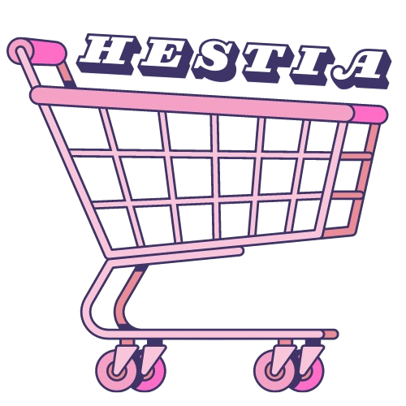

## ✩ [TRY IT NOW](https://10c345fa-d1df-4383-a520-5fcbf0d9b645-00-1fplx2t4j39p3.kirk.replit.dev/)

## ✩ ABOUT
A website that provides a platform for all small and local businesses to share their stories and struggles throughout the COVID-19 pandemic. 
This site showcases alternatives to big corporate chains that often use brands that are bad for our environment and community

⋆.˚✮ This site was featured in the 2020 EntrepreneuHER makeathon and here is the [slide deck](https://docs.google.com/presentation/d/1O6xAehsDkY9TCV0kDKdkEnHyTdMjVLPEJr_BmQJK1yk/edit?usp=sharing) 
including a demo video ✮˚.⋆

## ✩ KEY FEATURES
Interactive website that includes: a Google form where the user can input a local business they want to highlight, 
links to different local business in the area, etc.

## ✩ BUILT WITH
- Repl.it
- HMTL 
- CSS
- Javascript

